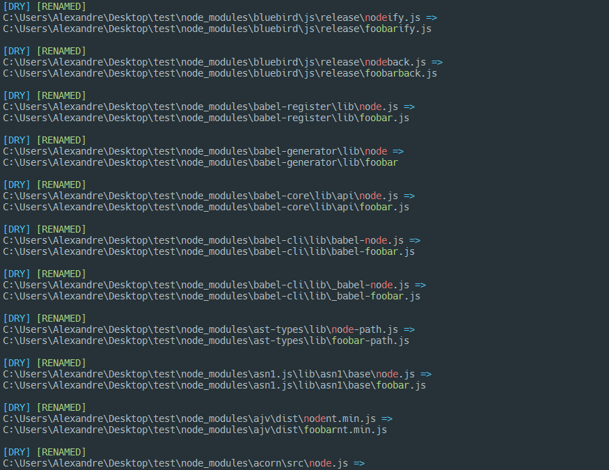

# Bulk rename

Bulk rename using regexes.

## Installation

```shell
npm install -g bulkren
```

## Usage

```
bren       <path> <find> <replace> [ignore] [options]
bulkren    <path> <find> <replace> [ignore] [options]

<path>     Path to search the nodes.

<find>     Regex used to match the node’s name. It applies only to the
           node’s name, not the entire path.

<replace>  A pattern for the new name. Use $1, $2, $n... to reference
           capturing groups from the find pattern.

[ignore]   Regex used to ignore nodes. It applies to the entire path.

Options:
  -n, --dry-run       Test the command.                                [boolean]
  -d, --ignore-dirs   Ignore directories.                              [boolean]
  -f, --ignore-files  Ignore files.                                    [boolean]
  -r, --recursive     List the directories recursively.                [boolean]
  -s, --silent        Don’t output anything to the standard outputs.   [boolean]
  --help              Show usage instructions.                         [boolean]
  --version           Show bulkren version.                            [boolean]

Examples:
  bren . "/foo/i" ../bar baz -d    Find nodes with the name “foo”(case
                                   insensitive), move it to the parent directory
                                   and rename it to “bar”. Any path containing
                                   “baz” is ignored. Directories named “foo”
                                   won’t be affected because of the flag “-d”.

  bren . foo ../bar baz -d         Find nodes with the name “foo”(case
                                   sensitive), move it to the parent directory
                                   and rename it to “bar”. Any path containing
                                   “baz” is ignored. Directories named “foo”
                                   won’t be affected because of the flag “-d”.

  bren . "/(foo)bar/i" "$1baz" -d  Find nodes with the name “foobar”(case
                                   insensitive), and rename it to “foobaz”.
                                   Directories named “foobar” won’t be affected
                                   because of the flag “-d”.
```
## Preview


